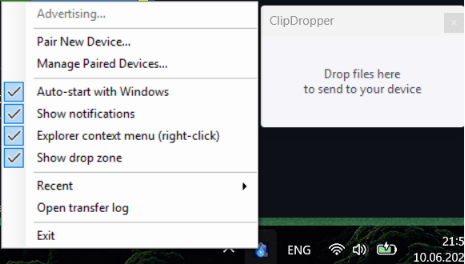
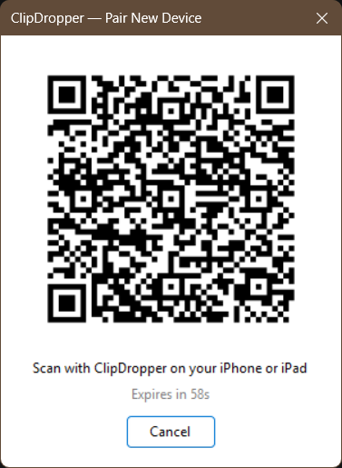

<div align="center">


# ClipDropper

**Sincronización del portapapeles entre Windows e iPhone — vía Bluetooth.**

Sin nube. Sin cuenta. Sin cables. Solo copia en un dispositivo y pega en el otro.

[](LICENSE)
[](https://github.com/emirhan-sonmez/ClipDropper/releases)
[](https://dotnet.microsoft.com/download/dotnet/8.0)
[](ClipDropper-iOS)

[Windows](#windows) · [Instalar en iPhone](#ios) · [Compilar desde el código](#compilar-desde-el-código) · [Cómo funciona](#cómo-funciona)

---

[🇬🇧 English](README.md) · [🇪🇸 Español](README.es.md) · [🇮🇹 Italiano](README.it.md) · [🇨🇳 中文](README.zh.md) · [🇰🇷 한국어](README.ko.md) · [🇷🇺 Русский](README.ru.md) · [🇹🇷 Türkçe](README.tr.md)

</div>

---

## Descripción General

ClipDropper es una aplicación en dos partes — un agente en la bandeja del sistema de Windows y una aplicación compañera para iPhone — que mantiene el portapapeles sincronizado a través de una conexión Bluetooth local.

- Copia texto o una imagen en tu PC → disponible al instante para pegar en tu iPhone
- Copia en iPhone → se pega en Windows
- Envía cualquier archivo o carpeta desde el Explorador de Windows con un clic derecho
- Todo permanece local — sin conexión a internet, sin servidores de terceros

---

## Capturas de Pantalla

<div align="center">


| | |
|:---:|:---:|
|  |  |
| **Conectado y listo** | **Share Sheet — envía desde cualquier app** |
|  |  |
| **Bandeja de Windows — todo a un clic** | **Emparejamiento QR con un escaneo** |

</div>

---

## Características

| | Característica | Detalles |
|---|---|---|
| **Portapapeles** | Sincronización de texto | Copia en un dispositivo, pega en el otro |
| **Portapapeles** | Sincronización de imágenes | Las capturas de pantalla e imágenes se transfieren sin problemas |
| **Archivos** | Transferencia de archivos | Clic derecho en cualquier archivo o carpeta → Enviar a ClipDropper |
| **Windows** | Bandeja del sistema | Se ejecuta silenciosamente en segundo plano |
| **Windows** | Inicio automático | Inicio opcional con Windows |
| **Windows** | Menú contextual | Integración con el Explorador de Windows |
| **Historial** | Registro de transferencias | Ver todo lo que has enviado |
| **Privacidad** | Solo local | Bluetooth + red local — sin nube |

---

## Cómo Funciona

ClipDropper utiliza **Bluetooth Low Energy (BLE)** para el descubrimiento y las cargas pequeñas, y cambia a un **servidor HTTP local** para transferencias más grandes como archivos e imágenes.

```
┌──────────────────────────┐                      ┌──────────────────────────┐
│       PC con Windows     │                      │       iPhone (iOS)       │
│                          │                      │                          │
│   ClipDropper.exe        │◄──── BLE GATT ──────►│   App ClipDropper        │
│   (Bandeja del sistema)  │   (texto, comandos)  │   (React Native)         │
│                          │                      │                          │
│   Servidor HTTP Local    │◄── Red Local ────────►│                          │
│   (autenticado por token)│   (archivos, imag.)  │                          │
└──────────────────────────┘                      └──────────────────────────┘
```

1. La aplicación de Windows anuncia un periférico BLE GATT
2. La aplicación del iPhone escanea y se conecta
3. Se intercambia un token de autenticación por BLE
4. El texto y las cargas pequeñas se transfieren por BLE
5. Los archivos e imágenes usan un servidor HTTP local protegido con un token de un solo uso

---

## Instalación

### Windows

1. Ve a la página de [Releases](https://github.com/emirhan-sonmez/ClipDropper/releases) y descarga `ClipDropper-Setup.exe`
2. Ejecuta el instalador — el Runtime de Escritorio de .NET 8 se detecta e instala automáticamente si falta
3. Inicia ClipDropper desde el Menú Inicio o el acceso directo del escritorio

**Alternativa: ejecutar sin el instalador**

La única dependencia es el gratuito [SDK de .NET 8](https://dotnet.microsoft.com/download/dotnet/8.0) (~200 MB, instalación única).

1. Instala el [SDK de .NET 8](https://dotnet.microsoft.com/download/dotnet/8.0)
2. Descarga o clona este repositorio
3. Haz doble clic en `ClipDropper-Windows\run.bat` — compila y lanza automáticamente

### iOS

La aplicación iOS aún no está en la App Store. Puedes instalarla gratis en tu iPhone con **Sideloadly** — sin cuenta de desarrollador ni jailbreak.

> **Aviso:** Las apps cargadas con un Apple ID gratuito caducan después de **7 días** y deben volver a firmarse. Sideloadly puede hacerlo automáticamente cuando el teléfono está conectado.

#### Paso 1 — Descarga los archivos

- Descarga **Sideloadly** (gratis): [sideloadly.io](https://sideloadly.io)
- Descarga `ClipDropper.ipa` desde la página de [Releases](https://github.com/emirhan-sonmez/ClipDropper/releases)

#### Paso 2 — Instala en tu iPhone

1. Conecta tu iPhone al PC mediante USB
2. Si se te solicita en el iPhone, toca **Confiar en este ordenador**
3. Abre Sideloadly y arrastra `ClipDropper.ipa` a la ventana
4. Introduce tu Apple ID y haz clic en **Start**
5. Espera a que se complete la instalación

#### Paso 3 — Confía en la aplicación

1. Ve a **Ajustes → General → VPN y gestión de dispositivos**
2. Bajo **Aplicación de desarrollador**, encuentra tu Apple ID
3. Toca **Confiar en "[tu Apple ID]"** → **Confiar**

#### Paso 4 — Activa el Modo Desarrollador (iOS 16 y posterior)

1. Ve a **Ajustes → Privacidad y seguridad → Modo Desarrollador**
2. Actívalo
3. Toca **Reiniciar** cuando se te solicite
4. Tras el reinicio, toca **Activar** para confirmar

---

## Compilar desde el Código

### Requisitos

| Herramienta | Versión mínima |
|------|----------------|
| .NET SDK | 8.0 |
| Windows | 10 (build 19041+, x64) |
| Node.js | 18+ |
| Inno Setup | 6.x _(solo instalador)_ |

### Aplicación Windows

```sh
cd ClipDropper-Windows
dotnet run
```

### Instalador Windows

```sh
ClipDropper-Windows\build-installer.bat
```

### Aplicación iOS

```sh
cd ClipDropper-iOS
npm install
npx expo start
```

---

## Contribuir

Las contribuciones son bienvenidas. Por favor abre un issue primero para discutir lo que te gustaría cambiar.

1. Haz un fork del repositorio
2. Crea una rama (`git checkout -b feature/tu-feature`)
3. Haz commit (`git commit -m 'feat: añadir tu feature'`)
4. Haz push y abre un Pull Request

---

## Licencia

MIT © [Emirhan Sonmez](https://github.com/emirhan-sonmez)
