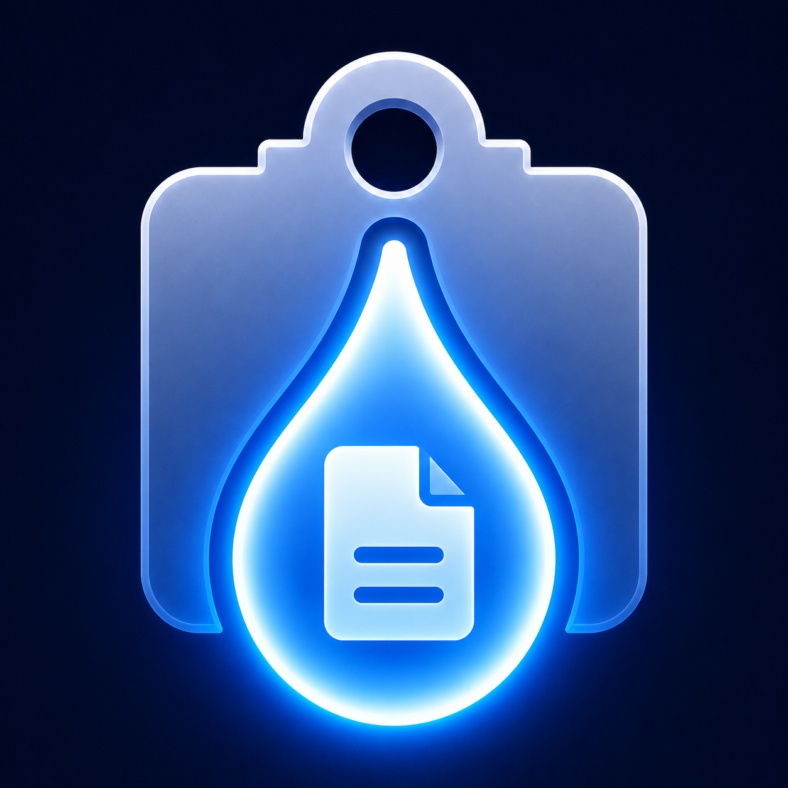

<div align="center">



# ClipDropper

**Clipboard sync between Windows and iPhone — over Bluetooth.**

No cloud. No account. No cables. Just copy on one device and paste on the other.

[](LICENSE)
[](https://github.com/emirhan-sonmez/ClipDropper/releases)
[](https://dotnet.microsoft.com/download/dotnet/8.0)
[](ClipDropper-iOS)

[Windows _(coming soon)_](#windows) · [Install on iPhone](#ios) · [Build from Source](#build-from-source) · [How it Works](#how-it-works)

</div>

---

## Overview

ClipDropper is a two-part app — a Windows system tray agent and an iPhone companion — that keeps your clipboard in sync over a local Bluetooth connection.

- Copy text or an image on your PC → instantly available to paste on your iPhone
- Copy on iPhone → pastes on Windows
- Send any file or folder from Windows Explorer with a right-click
- Everything stays local — no internet connection, no third-party servers

---

## Features

| | Feature | Details |
|---|---|---|
| **Clipboard** | Text sync | Copy on one device, paste on the other |
| **Clipboard** | Image sync | Screenshots and copied images transfer seamlessly |
| **Files** | File transfer | Right-click any file or folder → Send to ClipDropper |
| **Windows** | System tray | Runs silently in the background |
| **Windows** | Auto-start | Optionally launch with Windows |
| **Windows** | Context menu | Explorer right-click integration |
| **History** | Transfer log | View everything you've sent |
| **Privacy** | Local only | Bluetooth + local network — no cloud |

---

## How it Works

ClipDropper uses **Bluetooth Low Energy (BLE)** for discovery and small payloads, and switches to a **local HTTP server** for larger transfers like files and images.

```
┌──────────────────────────┐                      ┌──────────────────────────┐
│       Windows PC         │                      │       iPhone (iOS)       │
│                          │                      │                          │
│   ClipDropper.exe        │◄──── BLE GATT ──────►│   ClipDropper App        │
│   (System Tray)          │   (text, commands)   │   (React Native)         │
│                          │                      │                          │
│   Local HTTP Server      │◄── Local Network ───►│                          │
│   (token-authenticated)  │   (files, images)    │                          │
└──────────────────────────┘                      └──────────────────────────┘
```

1. The Windows app advertises a BLE GATT peripheral
2. The iPhone app scans and connects
3. An auth token is exchanged over BLE
4. Text and small payloads transfer over BLE characteristics
5. Files and images use an HTTP server on the local network, secured with the one-time token

---

## Installation

### Windows

> **Coming soon** — the Windows installer will be available on the [Releases](https://github.com/emirhan-sonmez/ClipDropper/releases) page. In the meantime, you can [build from source](#build-from-source).

<!--
1. Go to the Releases page and download `ClipDropper-Setup.exe`
2. Run the installer — it will detect and offer to install .NET 8 if missing
3. Launch ClipDropper from the Start Menu or desktop shortcut
-->

### iOS

The iOS app is not on the App Store yet. You can install it for free on your own iPhone using **Sideloadly** — no developer account or jailbreak required.

> **Heads up:** Apps sideloaded with a free Apple ID expire after **7 days** and need to be re-signed. Sideloadly can do this automatically when your phone is connected.

#### Step 1 — Download the files

- Download **Sideloadly** (free): [sideloadly.io](https://sideloadly.io)
- Download `ClipDropper.ipa` from the [Releases](https://github.com/emirhan-sonmez/ClipDropper/releases) page

#### Step 2 — Install on your iPhone

1. Connect your iPhone to your PC via USB
2. If prompted on your iPhone, tap **Trust This Computer**
3. Open Sideloadly and drag `ClipDropper.ipa` into the window
4. Enter your Apple ID and click **Start**
5. Wait for the installation to complete

#### Step 3 — Trust the app on your iPhone

Apple blocks untrusted apps from opening. You need to trust your own certificate once:

1. On your iPhone, go to **Settings → General → VPN & Device Management**
2. Under **Developer App**, find your Apple ID
3. Tap **Trust "[your Apple ID]"** → **Trust**

#### Step 4 — Enable Developer Mode (iOS 16 and later)

1. Go to **Settings → Privacy & Security → Developer Mode**
2. Toggle it **On**
3. Tap **Restart** when prompted
4. After restart, tap **Turn On** to confirm

The app is now ready to use.

---

## Build from Source

### Requirements

| Tool | Minimum Version |
|------|----------------|
| .NET SDK | 8.0 |
| Windows | 10 (build 19041+, x64) |
| Node.js | 18+ |
| Inno Setup | 6.x _(installer only)_ |

### Windows App

```sh
cd ClipDropper-Windows

# Run in development
dotnet run

# Build release
dotnet build -c Release
```

### Windows Installer

```sh
# Builds the app and compiles the installer in one step
# Requires Inno Setup 6: https://jrsoftware.org/isinfo.php

ClipDropper-Windows\build-installer.bat
```

Output: `ClipDropper-Windows\installer-output\ClipDropper-Setup.exe`

### iOS App

```sh
cd ClipDropper-iOS
npm install
npx expo start
```

---

## Project Structure

```
ClipDropper/
│
├── ClipDropper-Windows/          # .NET 8 WinForms tray application
│   ├── MainForm.cs               # Main UI, tray icon, event orchestration
│   ├── BlePeripheral.cs          # Bluetooth GATT peripheral (WinRT)
│   ├── HttpServer.cs             # Local file/image transfer server
│   ├── ClipboardMonitor.cs       # Windows clipboard change detection
│   ├── GattProtocol.cs           # BLE service & characteristic UUIDs
│   ├── SettingsStore.cs          # Persistent user settings (registry)
│   ├── StartupHelper.cs          # Auto-start & Explorer context menu
│   ├── TransferLog.cs            # Transfer history log
│   ├── setup.iss                 # Inno Setup installer script
│   └── build-installer.bat       # One-click installer builder
│
└── ClipDropper-iOS/              # React Native / Expo iOS app
    ├── App.tsx                   # BLE scanning, sync, file handling
    ├── app.json                  # Expo configuration
    └── assets/                   # Icons and splash screen
```

---

## Contributing

Contributions are welcome. Please open an issue first to discuss what you'd like to change or add.

1. Fork the repo
2. Create a feature branch (`git checkout -b feature/your-feature`)
3. Commit your changes (`git commit -m 'feat: add your feature'`)
4. Push and open a Pull Request

---

## License

MIT © [Emirhan Sonmez](https://github.com/emirhan-sonmez)
